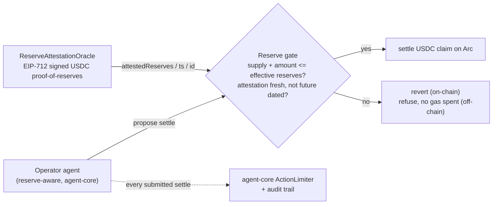
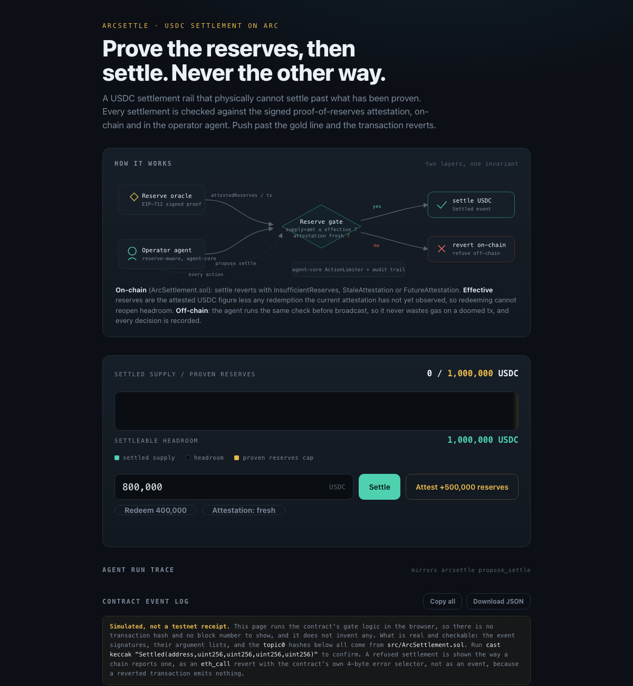

# ArcSettle

A USDC settlement rail for **Arc** (Circle's settlement chain) that **cannot settle
past its proven reserves**. Every settlement is gated by a signed proof-of-reserves
attestation: if settling would push circulating claims above the USDC reserves that
have actually been proven, the transaction reverts. Prove first, then settle.

On Arc the reserve asset, the settled asset, and gas are the same regulated dollar,
so the invariant "settled claims never exceed attested USDC reserves" is expressed in
one unit end to end, with no bridge seam in the middle of the guarantee.

**Milestone 1** of the ArcSettle grant proposal: the reserve-gate contract plus the
EIP-712 attestation oracle, ported to Arc and denominated in USDC. Arc testnet only,
never mainnet.

Read [docs/LIMITATIONS.md](docs/LIMITATIONS.md) first for the short version of what is
proved, what is simulated, and what is not built. Nothing on this page contradicts it.

## The 30-second demo

```
$ arcsettle demo
[offline model] the numbers below come from this source, not from a screenshot.
1) Attested reserves: 1,000,000 USDC, settled supply 0.
2) settle 800,000 (within reserves):
    settled
3) settle 300,000 (would exceed reserves):
    refused: InsufficientReserves - headroom is only 200,000 USDC.
4) redeem 200,000 -> supply falls, headroom does NOT reopen:
    redeemed -> supply 600,000, headroom 200,000 (redemption debt 200,000 still
    netted off reserves).
5) A new proof-of-reserves attestation of 1,500,000 USDC post-redemption -> headroom reopens:
    settled -> supply 900,000 USDC. Prove, then settle.
```

Step 4 is the one worth pausing on. Most reserve-gated designs let a redemption reopen
settlement capacity the instant supply falls, which lets an operator redeem, move the
freed USDC out, and re-settle against the same stale proof. Here the freed amount is
booked as `pendingRedemptions` and netted off attested reserves until a **new**
attestation has actually observed the outflow.

The same guarantees are enforced on-chain, and `forge test` proves each of them.

## Architecture



Two contracts, one invariant:

- **`src/ReserveAttestationOracle.sol`**: USDC reserve figures enter only against an
  EIP-712 signature from a registered attestor. The signer is recovered on-chain;
  replays are refused by a strictly incrementing nonce; malleable, wrong-length and
  out-of-range signatures are refused; backdated and future-dated attestations are
  refused. Submission is permissionless, so liveness never depends on one relayer.
  Adding an attestor is timelocked two days; revoking one is immediate.
- **`src/ArcSettlement.sol`**: `settle` reverts with `InsufficientReserves` if
  `totalSupply + amount` would exceed **effective** reserves, `StaleAttestation` if the
  proof is older than `maxAttestationAge`, or `FutureAttestation` if it is dated ahead
  of the block. The oracle and the freshness bound can only be changed through a two-day
  timelocked proposal, and `maxAttestationAge` is clamped to `[1 minute, 7 days]`, so
  "turn the freshness check off" is not a reachable state. Balances track USDC's native
  6 decimals.
- **`arcsettle/`**: the operator agent runs the same check before it would broadcast, so
  an autonomous treasury never wastes gas on a doomed transaction. A refusal costs no
  action quota; only a settlement that will actually be submitted spends one.

## Run it

```bash
# contracts
forge test                     # 59 tests across the settlement rail and the reserve oracle

# operator agent (agent-core is vendored under agent_core/, no monorepo install needed)
PYTHONPATH=. python -m arcsettle.main demo
PYTHONPATH=. python -m arcsettle.main status
PYTHONPATH=. python -m arcsettle.main settle 800000
PYTHONPATH=. python -m arcsettle.main redeem 400000
PYTHONPATH=. python -m arcsettle.main runs      # the audit trail this process recorded
```

### Live mode (read-only)

```bash
export ARC_RPC_URL=https://<your-arc-testnet-rpc>
export ARC_SETTLEMENT_ADDRESS=0x...
export ARC_ORACLE_ADDRESS=0x...        # optional, adds oracle reads
export ARC_SETTLE_RECIPIENT=0x...      # needed for the settle dry-run
PYTHONPATH=. python -m arcsettle.main status
```

`status` becomes real `eth_call`s and reports `live:<chain-id>`. A proposed settlement
is dry-run with `eth_call`, so the revert reason comes from the contract's own custom
error rather than from a local guess. Configuration is validated up front, with every
problem reported at once.

Broadcasting a signed settlement is **not implemented**: it needs a funded Arc testnet
key and a secp256k1 signer, which this repo does not ship. `apply_settle` says so
explicitly in live mode. That path is milestone 3. See [docs/LIMITATIONS.md](docs/LIMITATIONS.md).

## Tests

- `forge test`, **59 Solidity tests** (solc 0.8.24). The reserve gate is the hero; the
  redeem-then-resettle defence, the timelocked oracle rotation, and the EIP-712 proof
  path each have their own tests.
- `pytest tests -q`, **75 Python tests**. No env vars or credentials needed; the audit
  store is forced in-memory by `tests/conftest.py`.

Every defence in this repo has a test that fails without it.

## Paper, deck & UI

- **Paper:** `paper/paper.tex`, a short technical write-up (build: `tectonic paper/paper.tex` or Overleaf).
- **Deck:** `deck/deck.md`, a Marp slide deck (build: `marp deck/deck.md --pdf`).
- **UI:** `ui/index.html`, the interactive reserves-gauge demo (opens offline, `file://`).
  It is a browser simulation and says so on the page; it shows the contract's real event
  signatures, `topic0` hashes and error selectors, and no invented transaction hashes.
- **Demo:** `DEMO.md`, the recording kit for the ~75s video.



## Cite

```bibtex
@software{sarkar_arcsettle_2026,
  title   = {ArcSettle: Reserve-Gated USDC Settlement with On-Chain Proof-of-Reserves on Arc},
  author  = {Dipankar Sarkar},
  year    = {2026},
  url     = {https://github.com/doom2quake/arcsettle},
  license = {MIT}
}
```

## License

MIT, held by doom2quake, see [LICENSE](LICENSE).
